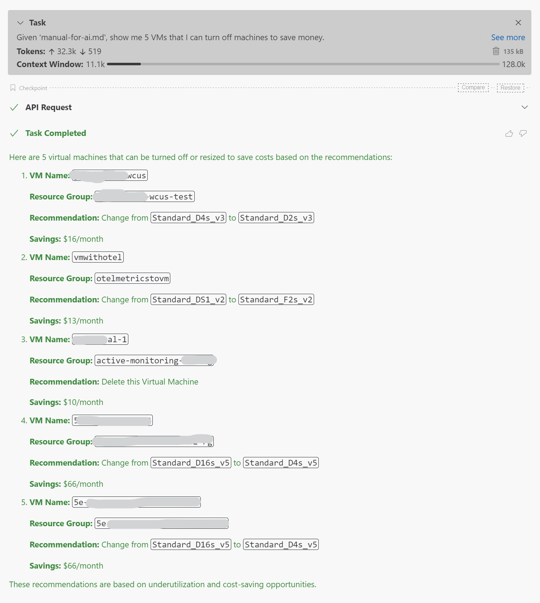

# Blue Bridge

A Model Context Protocol (MCP) server for querying and managing Azure resources with zero‑secret authentication.  
Out of the box it supports:

- **Azure Managed Grafana**
- **Azure Data Explorer (Kusto)**
- **Azure Resource Graph**
- **Azure Resource Manager**

Authentication is handled by the signed‑in Azure CLI account or a Managed Identity—no passwords or keys are stored.

---

# 🚀 Quick start

## 0 · Clone the repository

Clone the repository to get the necessary files, including recipes and usage examples found in `manual-for-ai.md`.

```bash
git clone https://github.com/Azure/blue-bridge.git
cd blue-bridge
```

## 1 · Run the container

Set the optional environment variables you need and start the image:

```bash
docker run --name bluebridge -p 6688:6688 \
  -e BlueBridgeOptions__AzureManagedGrafanaEndpoint=https://<my‑grafana>.wcus.grafana.azure.com \
  -e BlueBridgeOptions__AzureDataExplorerUri=https://<my‑kusto>.westus2.kusto.windows.net \
  bluebridge.azurecr.io/bluebridge:latest
```

If you only need Kusto:

```bash
docker run --name bluebridge -p 6688:6688 \
  -e BlueBridgeOptions__AzureDataExplorerUri=https://<my‑kusto>.westus2.kusto.windows.net \
  bluebridge.azurecr.io/bluebridge:latest
```

Or with no external services:

```bash
docker run --name bluebridge -p 6688:6688 \
  bluebridge.azurecr.io/bluebridge:latest
```

## 2 · Authenticate once

On first start the container prints a device‑code prompt such as:

```
To sign in, use a web browser to open the page https://microsoft.com/devicelogin
and enter the code ABCD‑EFGH to authenticate.
```

Open the link, enter the code, and grant consent.  
After that the server is ready at **http://localhost:6688**.

## 3 · Add to your MCP host

```jsonc
{
  "mcpServers": {
    "blue-bridge": {
      "url": "http://localhost:6688/sse",
      "transportType": "sse",
      "timeout": 60,
      "disabled": false,
      "autoApprove": []
    }
  }
}
```

## 4 · Run a quick test

Ask your MCP host:

```
Given 'manual-for-ai.md', show me 5 VMs that I can turn off machines to save money.
```



---

## 🔧 Environment variables

| Variable                                           | Purpose                                         | Required |
| -------------------------------------------------- | ----------------------------------------------- | -------- |
| `BlueBridgeOptions__AzureManagedGrafanaEndpoint`   | Azure Managed Grafana endpoint URL              | No       |
| `BlueBridgeOptions__AzureDataExplorerUri`          | Azure Data Explorer (Kusto) cluster URI         | No       |

---

## 📚 Links

- Docs & samples: https://aka.ms/blue-bridge
